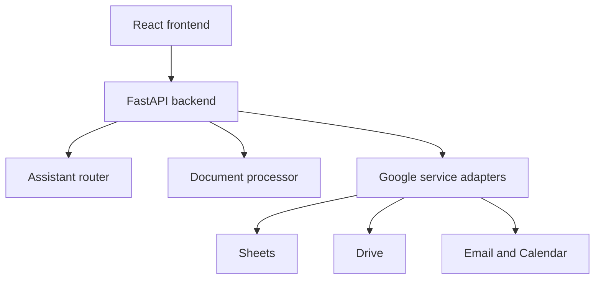

# VendorFlow

VendorFlow is a full-stack vendor-onboarding workflow prototype built with React and FastAPI. It demonstrates vendor intake, document tracking, approval routing, follow-up actions, and optional Google Workspace and Gemini integrations.

> The repository is designed as a hackathon/demo prototype. When Google credentials are unavailable, service modules use mock or in-memory behavior so the workflow can still be demonstrated.

## What Is Implemented

- Vendor intake and status views
- Vendor-type-based document checklists
- Document upload and metadata extraction flow
- Approval and follow-up actions
- Natural-language assistant interface backed by deterministic demo behavior
- Google OAuth and Workspace service adapters
- React frontend served separately during development or as a production build

## Current Limitations

- Gemini function calling is not currently active; the assistant uses deterministic mock routing.
- Drive upload in the API route is currently disabled.
- Workspace actions require valid Google Cloud credentials and additional production hardening.
- Authentication, authorization, durable job scheduling, audit logging, and automated tests remain future work.

## Architecture



## Tech Stack

- React 19, Vite, React Router, Tailwind CSS
- FastAPI and Pydantic
- Google Workspace APIs
- Gemini SDK with mock fallback
- Docker and Google Cloud Run configuration

## Local Setup

### Backend

```bash
git clone https://github.com/Leadyhere/Vendorflow.git
cd Vendorflow/backend
python -m venv .venv
source .venv/bin/activate
pip install -r requirements.txt
uvicorn main:app --reload
```

On Windows, activate the environment with `.venv\Scripts\activate`.

### Frontend

```bash
cd frontend
npm ci
npm run dev
```

Copy `.env.example` to `.env` and fill only the services you intend to test. Do not commit `.env`, `credentials.json`, or OAuth tokens.

## Verification

```bash
cd frontend
npm run lint
npm run build
```

## Roadmap

- Replace mock assistant routing with validated function calls
- Enable secure Drive uploads and file validation
- Add role-based authorization and an audit trail
- Add backend and frontend tests
- Add background job infrastructure for scheduled follow-ups

## License

No license has been selected yet.
