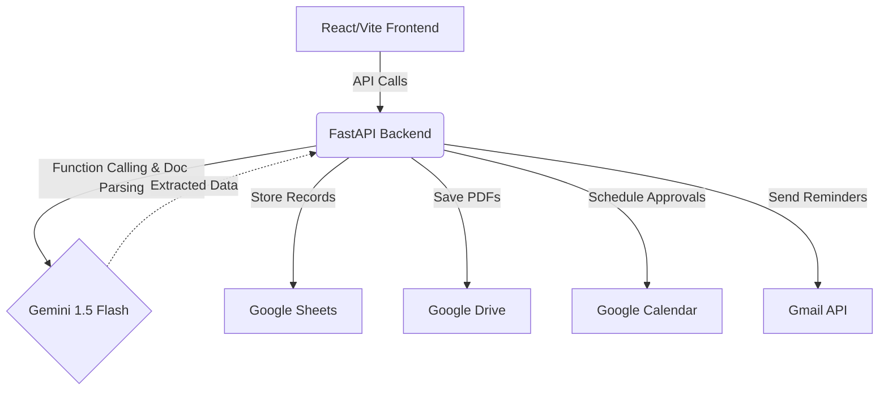

# VendorFlow — AI-Powered Vendor Onboarding Agent

## Chosen Vertical
B2B Internal Workflow Automation

## Problem Statement
The vendor onboarding process is traditionally a massive operational bottleneck, taking 3-6 weeks on average. It is plagued by manual email chains, unorganized document collection, back-and-forth validation of messy PDFs (like insurances and tax certificates), and siloed approval routing between Legal, Finance, and IT. This delays procurement, frustrates suppliers, and drains internal resources.

## Approach & Logic
VendorFlow employs an agentic architecture powered by Google Gemini 1.5 Flash. 
- **Dynamic Checklists:** The backend dynamically generates documentation requirements based on the vendor type (Goods, Services, IT).
- **Intelligent Extraction:** Uploaded documents are processed by Gemini to instantly extract key data points (expiry dates, registration numbers) and validate authenticity.
- **Agentic Orchestration:** The core `gemini_agent.py` uses function calling. Procurement staff can type natural language commands (e.g., "Remind Acme Corp about missing docs" or "What's the status of the latest vendor?"). The agent translates these intents into actionable tool calls like `send_reminder_email`, `schedule_approval_meeting`, or `get_vendor_status`.

## How It Works
1. **Intake:** The procurement team submits a new vendor via the React frontend.
2. **AI Checklist:** Gemini determines the required documents (e.g., SOC2 for IT, Product Liability for Goods).
3. **Document Upload & Extraction:** Vendors upload PDFs. The backend intercepts them, stores them in Drive, and sends them to Gemini 1.5 Flash. Gemini extracts data (e.g., Expiry Date) and marks the document as Received/Valid.
4. **Agent Monitoring:** If documents remain pending for >48 hours, a background job uses the Gmail API to auto-send a formatted follow-up email detailing exactly what is missing.
5. **Approvals Routing:** Once documents are verified, the procurement team triggers Legal/Finance approvals. The Calendar API automatically schedules review meetings with the necessary stakeholders.

## Google Services Used
1. **Google Gemini 1.5 Flash:** Core AI engine. Used for dynamic checklist generation, intelligent PDF data extraction/validation, and powering the natural language chat agent via function calling.
2. **Google Sheets API:** Acts as our lightweight database. Stores vendor records, status, and extracted document metadata in a structured, easily accessible format.
3. **Google Drive API:** Provides structured, secure file storage. Uploaded vendor documents are saved here into specific vendor folders for easy access and sharing.
4. **Google Calendar API:** Automates approval routing by scheduling review meetings with Legal or Finance teams once documents are fully collected.
5. **Gmail API:** Automates follow-ups. If a vendor stalls, the app drafts and sends a professional reminder email listing the specific missing documents on behalf of the procurement team.

## Architecture Diagram


## Setup Instructions
1. **Clone & Navigate**
   ```bash
   git clone <repo_url>
   cd VendorFlow
   ```
2. **Backend Setup**
   ```bash
   cd backend
   python -m venv venv
   # Windows: .\venv\Scripts\activate
   # Mac/Linux: source venv/bin/activate
   pip install -r requirements.txt
   ```
3. **Environment Variables**
   Rename `.env.example` to `.env` in the root folder and add your `GEMINI_API_KEY`. (The app uses robust mock fallbacks for Google Workspace APIs if `credentials.json` is not provided, allowing for immediate demoing).
4. **Run Backend**
   ```bash
   # From the backend folder
   uvicorn main:app --reload
   ```
5. **Run Frontend**
   ```bash
   # Open a new terminal
   cd frontend
   npm install
   npm run dev
   ```

## Assumptions Made
- The primary user is an internal procurement manager, not the vendor themselves (vendors receive a secure link or email to upload docs, though the UI here simulates both sides for demo purposes).
- Google Workspace is the company's primary ecosystem.
- For hackathon demonstration purposes, if explicit Google Cloud OAuth credentials (`credentials.json`) are absent, the application gracefully falls back to intelligent in-memory mocking to ensure the UI and agentic flows remain fully functional and assessable by judges.
